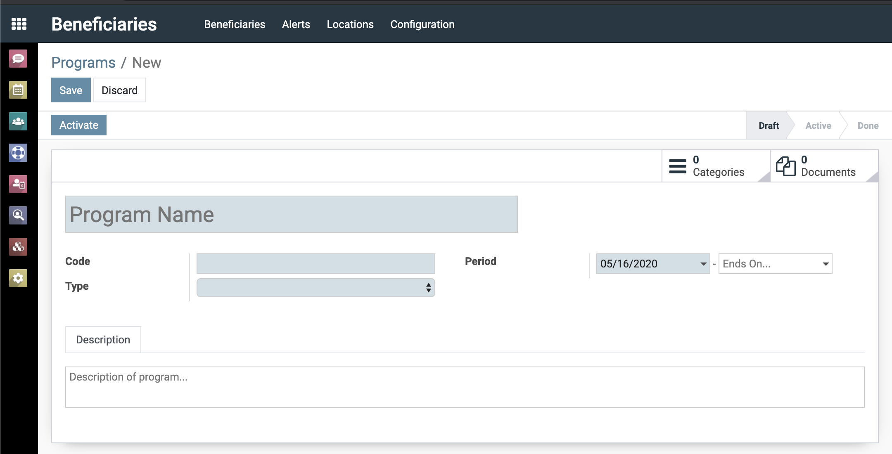
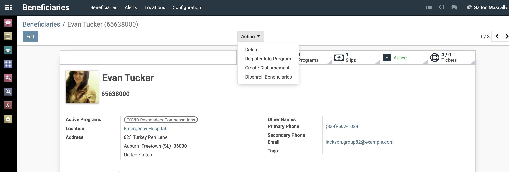
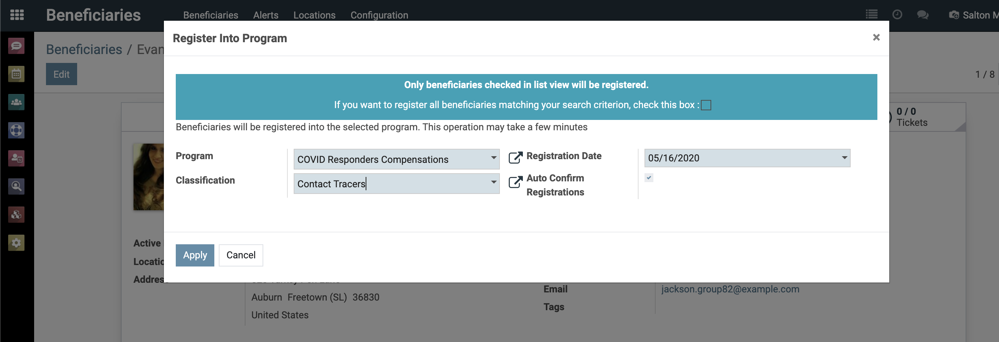
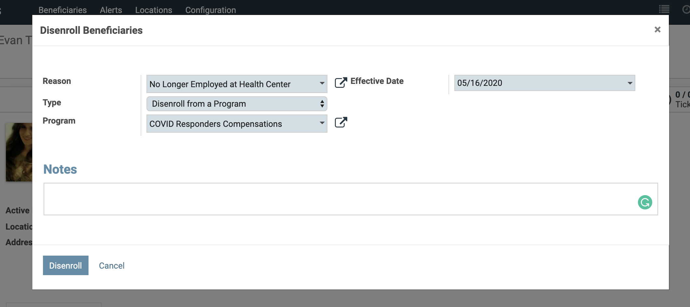

Organizations can manage multiple cash transfer programs without needing to have separate instances of the ERP per program. Additionally these programs can make references to the same beneficiary database. A consequence of this is that a beneficiary in the **registry** does not ensure inclusion in disbursement lists. That beneficiary should to have an active enrollment in the program for which the disbursement list is being generated.

Additionally beneficiaries can be registered to more than one program at a time as we are working on defining program exclusion rules that can disallow active enrollments into "incompatible" programs.

## Creating A Program

A program is created by going to `Beneficiary/Configuration/Programs` menu.

{:width="80%"}

Enter the details of your program. `Ends On` is optional and only needs to be specified if your program has a fixed term. After this date, disbursements lists can no longer be generated for that program, enrollments to that program will be inactivated and that the program closed.

{:width="80%"}

| Field        | Required | Description                                                                                                                                                          |
|--------------|----------|----------------------------------------------------------------------------------------------------------------------------------------------------------------------|
| Program Name | True     | Descriptive name of program. e.g. Covid-19 Relief to Pregnant Women                                                                                              |
| Code         | True     | Not more than 5 letter acronym of the program                                                                                                                        |
| Type         | True     | The type of program. 1) Remuneratory for worker compensation schemes 2) Safety Net for social protection schemes. Choice affects data collected on beneficiaries |
| Period       | True     | Start and end date of the program. End date only for fixed-term programs. When in doubt leave the end date empty                                                  |
| Description  | False    | Optional extended description of the program                                                                                                                         |

## Program Categories

**Program categories** is an important concept central to how disbursement amounts are computed for beneficiaries. These are classifications that are assigned to beneficiaries as they are registered into a program and influences their disbursement. These are categories are usually directly aligned with the pay grades/scale of the program. In the example of frontline health workers compensation scheme these can be: contact tracers, burial team, and nurses, with each having different disbursement amounts.

Categories for a program are added by clicking on the `Categories` button from the program form.

{:width="80%"}

| Field               | Description                                                                                                                                                                       |
|---------------------|-----------------------------------------------------------------------------------------------------------------------------------------------------------------------------------|
| Classification      | Classification/Category Name, e.g. Contact Tracer                                                                                                                          |
| Program             | Program that this classification is being added to                                                                                                                                |
| Structure           | A ruleset that defines how disbursement amount for beneficiaries with this classification is computed. The default structure simply uses the disbursement amount specified below but can be complex enough to factor in variables from the beneficiaries' data.  |
| Disbursement Amount | Amount to disburse to beneficiary at each cycle                                                                                                                              |

Structure is an advanced settings that allow you to define complex rules around how disbursement are generated for a beneficiary, examples include, taking into account gender, number and age of dependents, vulnerability scores, compensation for mobile money cashout fees etc. See the [advanced disbursement tutorials](./advanced/disbursement-configuration) for more information.

## Registering Beneficiaries to Programs

A prerequisite to registering beneficiaries into programs is first enrolling that beneficiary into the ERP; head there for [more information](enrollment.md).

A beneficiary can be enrolled from the `actions` button dropdown on the beneficiary record; clicking on `Register into Program` brings up a form to  select program and assign to a classification/category.

{:width="80%"}

{:width="80%"}

>**WARNING**: See [What Determines Inclusion in Disbursement List](#what-determines-inclusion-in-disbursement-list) section below to understand the importance of `enrollment Date`.

Beneficiary enrollments are not automatically confirmed but enters a workflow for user with the `Program Manager` role to confirm that enrollment into a program. However if the action above is being undertaken by someone with that role, the `Auto Confirm enrollments` option bypasses and automatically confirms the enrollment.

Anyone with the `Enrollment Officer` officer role can start the enrollment process.

You can also enroll a list of beneficiaries by filtering by some criteria and then mass registering the resulting list to a program.

{:width="80%"}

>**NOTE**: You need to be in the **list view** to perform this action.

## Removing Beneficiaries from Program

A prerequisite to de-registering beneficiaries from a program is defining a list of valid reasons for de-registering. This is done via the `Enrollment\Configuration\Disenrollment Reasons` menu

{:width="50%"}

Beneficiaries are removed from programs when the end date on the program enrollment is reached (if fixed-term), or when the enrollment status is manually closed.

To remove manually from a program, select the beneficiary and from the action menu, click on `Disenroll Beneficiairies`.

{:width="80%"}

{:width="80%"}

| Field          | Description                                                                                                                                                                                                                                 |
|----------------|---------------------------------------------------------------------------------------------------------------------------------------------------------------------------------------------------------------------------------------------|
| Reason         | Dropdown list of configured reasons for de-enrollment                                                                                                                                                                                  |
| Type           | Supports two types "Disenroll from program" which is what we want in this case as simply deregisters beneficiary from a program and "End of Programs and Archive" which de-registers beneficiary from all programs and archives their record |
| Program        | The program we wish to de-register beneficiary from                                                                                                                                                                                         |
| Effective Date | The effective date. If in the future, the action will not be preformed until then at which time the ERP will automatically de-register the beneficiary                                                                                      |
| Note           | Additional notes explaining the action  |

Clicking `Disenroll` does not automatic deregister the beneficiary but starts an auditable workflow that needs to be confirmed by a user with the `Program Manager` role. Active de-enrollment request can be found at `Enrollment\Disenrollment` menu. If the effective date on the de-enrollment record is not in the future, the beneficiary is immediately deregistered from program otherwise the ERP will deregister beneficiary once that effective date is reached.

{:width="80%"}

Anyone with the `Enrollment Officer` officer role can start the de-enrollment process. This allows location administrators to propose de-enrollment of beneficiaries who no longer are under their purview or no longer meet criteria.

### What Determines Inclusion in Disbursement List

Beneficiaries are only included in disbursement lists if they are actively registered to the program for which that list was generated. However there cases in which the beneficiary might be not be included though carrying an active enrollment or included even though they do not have active enrollments in a program.

- **Beneficiary has active enrollment but the start date is after the end date of the current disbursement cycle**

	Covered in more details in the [disbursement guide](disbursing.md), disbursements cycle are bounded periods with start and end dates or from and to date. If the enrollment start date falls outside the end date of the current disbursement cycle, it is assumed that beneficiaries enrollment should only apply after that cycle and so not included in the disbursement batch.

- **Beneficiary has inactive enrollment but the end date is before the end date of the disbursement cycle**

	Inversely, if the beneficiary's enrollment is deactivated but the end date on the enrollment falls within the disbursement cycle, that is greater than the start date but lesser than the end of the cycle, it is assumed that beneficiary is part of that cycle and so included in the disbursement list for that cycle.

> To de-register a beneficiary and have them not factored into a cycle, set the end date of the de-enrollment action to one before than the start date of the cycle.
>
]{: .important}

## Relevant User Roles

@TODO

## Where to go next

- [Enrolling Beneficiaries](./enrollment.md)
